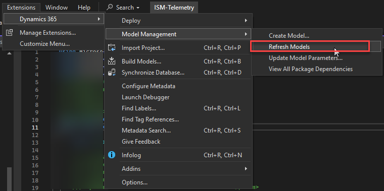

# Dynamics 365 Finance & Operations Telemetry samples
This repository provides samples for utilizing Dynamics 365 Finance & Operations. It will give you a libary which enables you to start emitting your own telemetry in a easy manner. 

This model also includes already telemetry for the following: 

- Batch job monitoring
- DMF Import and Export analytics
- Excel exports
- Business events tracking
- Partial Dual-write support


## Table of Contents

- [Introduction](#introduction)
- [Prerequisites](#prerequisites)
- [Installation](#installation)
- [Configure AppInsights](#Configure-telemetry-logging-in-Finance-&-Operations)
- [Import Data explorer dashboard](#Configure-Azure-Data-Explorer-dashboard)
- [Usage](#usage)
- [Class usage and functions](#class-usage-and-functions)
- [Contributing](#contributing)
- [License](#license)

## Disclaimer / Support
Please note that this is not supported by Microsoft in anyway. This means if you raise a ticket, support won't help you on issues related to this repo. 
It is provided AS IS and it can break anytime. Use at your own assessment and at your own risk. 

If you need support or assistance, please use the "Discussions" section in this repo.

## Introduction

This project provides sample implementations of telemetry in D365 FSCM. It includes creation of a telemetry Base class to demonstrate how to utilize SysApplicationInsightsTelemetryLogger to log Events/metrics/traces with properties to ApplicationInsights. It also includes an extension to the MonitoringAndTelemetry module to control the granularity of logging to Application Insights.

## Prerequisites

- Dynamics 365 Finance and Supply Chain Management environment
- Visual Studio 2019 or later
- .NET Framework 4.7.2 or later
- Access to Azure Application Insights

## Installation

1. Clone the repository OR download the "ISMModel" folder
2. Add the ISMModel to your PackagesLocalDirectory folder
3. If you use an UDE environment, you "Configure metadata" and point the folder for Custom metadata to the "Metadata" folder
    

4. If you use a non UDE environment, copy the "src/xpp/Metadata/ISMModel" into the PackagesLocalDirectory folder of your installation
5. Refresh the models in VS
    

6. Build the model "ISMModel"
7. Enable the feature "Monitoring and Telemetry" in "Feature management workspace" if not enabled by default
    

9. Once the changes are all built, open the menu "Monitoring and telemetry parameters" 
    

10. You should see a custom tab called "Logging settings"
    

## Configure telemetry logging in Finance & Operations

See also [Get started with telemetry for finance and operations apps](https://learn.microsoft.com/en-us/dynamics365/fin-ops-core/dev-itpro/monitoring-telemetry/monitoring-getting-started)

1. Open the menu "Monitoring and telemetry parameters" 
    

2. Go to "Application Insights Registry"
    

    And add the "Instrumentation key" from your Azure Application Insights resource into the field "Instrumentation key"  or the connection string
    


3. Move to tab "Environments"
    
    Add your "Environment Id" into the field, you will find the Environment Id as follows:

    **You are using LCS:**
    Go to the LCS Environment overview page, copy field "Environment Id" of the current environment.
    


    **Youre using an UDE Environment:**
    Copy the "Environment Id" from the Power platform admin center
    


4. Move to tab "Configure" and enable the events you want to log
    

The telemetry should be emitting after the setup is complete. To test, simply schedule a batch job. 

## Configure Azure Data Explorer dashboard

After or before importing the dashboard, the datasources can be replaced with your Azure insights resource. 
You can replace it simply in an editor in the downloaded JSON file or you import it and do it step by step manually. 

The datasource needs to be formatted like this:

```bash
cluster("https://ade.applicationinsights.io/subscriptions/<Your Subscrition ID>/resourceGroups/<Your resourcegroup>/providers/microsoft.insights/components/<AppInsights name>").database("<AppInsights name>")
```
You can simply also open the AppInsights resource in Azure portal, and copy parts of the URL on top:


1. Download the dashboard you want from the repo folder "Dashboards"
2. Open Azure Data Explorer (https://dataexplorer.azure.com/dashboards/)
4. Go to "New Dashboard" -> New Dashboard from File
   
5. Open the dashboard and go to "Edit" mode
   
6. Now you need to replace all datasources and point it to your AppInsights resource with above string if you havent done it yet.
7. Replace in datasource:
   
8. Replace in parameters: (Not required if not set anywhere) 
   
9. Replace in all tiles / queries (Not required if not set anywhere) 
   

## Usage 

With the base classes you have the ability to log telemetry almost in any circumstance where the standard code allows extensions. You can build your own telemetry for multiple purposes including: 

- Performance tracking, e.g. of key business processes to measure KPIs and report on them
- Tracing of processes to troubleshoot in test instances
- Build in telemetry by default on any new customization to measure performance

### Practical example 

The "ISMTelemetryGeneric" class is the fully implemented version of telemetry tracking, lets take that one as an example:

```
/// <summary>
/// Generic telemetry class for ISM model
/// </summary>
class ISMTelemetryGeneric extends ISMTelemetryBase

{
    public void new()
    {
        super();
        
        this.eventId = ISMTelemetryEventIds::ISMEvent;
    }

    // if the log level is set to information it will log the request and response data as wekk as there is an error
    protected boolean shouldLogEvent()
    {
        return true;
    }

    protected void postPopulateProperties()
    {
    }

}
```

Whenever you declare the telemetry class, it will automatically start a stopwatch and will capture the time when you do "processEvent". 

We want to measure how long it takes to run a "Customer account statement" 


It has multiple parameters of some which we want to also emit to telmetry. 

1. Extend the class "CustAccountStatementExtController"
2. Declare the telemetry class
3. Declare new event names however required
4. process the event

Code for the extension

```
[ExtensionOf(classStr(CustAccountStatementExtController))]
internal final class ISMCustAccountStatementExtController_Extension
{
    protected void runPrintMgmt()
    {

        ISMTelemetryGeneric telemetry = new ISMTelemetryGeneric(); //This will start the stopwatch

        next runPrintMgmt();

        telemetry.processEvent(ISMTelemetryEventNames::CustomerStatement);
    }

}

```

Code for the Eventname:
```
/// <summary>
/// Defines Telemetry event names logged into AppInsights
/// </summary>
public final class ISMTelemetryEventNames
{
    public static const str ISMEventName                         = 'ISMEventName';
    public static const str BatchJobStatusUpdate                = 'BatchJobStatusUpdate';
    public static const str BatchJobCreated                     = 'BatchJobCreated';
    public static const str BatchStatusUpdate                   = 'BatchStatusUpdate';
    public static const str CustomerStatement                = 'CustomerStatement';

}
```

The eventname will then be displayed as "name" in AppInsights and is your identifier. 
The telemetry class you declare can be your own created one, or the generic one, its up to you and depends always on the process you need to execute. Sometime you need to still fetch data to further process. 


If we want to add additional properties e.g. from the previous screenshot of the user selection, we can add them with "addRuntimeProperty" 

1. Adding a new line for "CustAccount" in "ISMTelemetryProperties"
```
public static const str CustAccount 		        = 'CustAccount';
```
2. Changing the extension to add a runtimeproperty
```
[ExtensionOf(classStr(CustAccountStatementExtController))]
internal final class ISMCustAccountStatementExtController_Extension
{
    protected void runPrintMgmt()
    {

        ISMTelemetryGeneric telemetry = new ISMTelemetryGeneric(); //This will start the stopwatch

        CustAccountStatementExtContract contract = this.parmContract() as CustAccountStatementExtContract;
        
        telemetry.addRuntimeProperty(ISMTelemetryProperties::CustAccount, contract.parmCustAccount());
        
        next runPrintMgmt();

        telemetry.processEvent(ISMTelemetryEventNames::CustomerStatement);
    }

}
```   

Deploy your model for UDE or build it on a LCS environment, then run the report. 

Once you run the report you will see the telemetry like this:


## Class usage and functions 

### UI turn off/on switch for cost savings 
In the UI you will find a on/off switch which enables you to disable sending telemetry for a specific class. This can be used for cost saving if a class was introduced only for temprary logging. 


The "Enabled" will completely enable or disable logging
The "Severity level" you can define when you are using "processTrace" method to do traces. 

### Types of telemetry
you will be able to proces different types of telemetry:

- processEvent --> Will process appInsights events into table "customEvents"
- processTrace --> Will process appInsights traces into table "traces"
- processMetric --> Will process appInsights metrics into table "customeMetrics"

In most cases the "processEvent" are beeing, depending on the need of the customer. Metrics are working as well but its limited on how many additional dimensions can be used. 
processTrace should be used if you want to trace a specific processs, e.g. a new functionality where you want to track very detailed at the beginning but want to reduce it once the feature settles down.

### Tracking time in telemetry 
By default, every time you declare a class like telemetry = new ISMTelemetryGeneric(), it will start a .NET stopwatch. Once you do "processEvent", "processTrace" or "processMetric" it will capture the elapsed time and store it automatically as "ElapsedTimeMilliseconds" in your telemetry data. Also it will restart the stopwatch, in case you want to track more data. 

From a data perspective, each appInsights entry will have either the time captured from declaration to event processing or from previous event to current event. 

### 

### Conditional logging shouldLogEvent 

With the overload of the method "shouldLogEvent" you can decide yourself, based on condition if you want to log data or not, this could be a local variable you declared and want to use it to determine to log or not, or it could be something completely for your needs. 

### Post populate properties

the method "postPopulateProperties" is beeing called when you do "processEvent" / "processMetric" / "processTrace". 
You can enrich data at the point if required. 

### Adding callStacks

After declaring the class you can use:

```
telemetry.addCallStack();
```

To add the current callStack to the code, this can be used when you log errors, but be aware, adding a callstack does have performance overhead, do not use it frequently 

### Base properties vs Runtime properties 

When using telemetry, you can use base properties which you can declare in your telemetry class. The base property reflects something in the process you always want to track, e.g. Site & Warehouse or a order identifier.
This can be used if you declare the telemetry on a class level and you process the telemetry on multiple stages across your code, then you dont't want to declare over and over the same properties.

This could be the case for the customer statement as example above, instead of adding it manually, you can create a own telemetry class for it, where you enricht additional data and then add it as base property. 

```
internal final class ISMTelemetryCustStatement extends ISMTelemetryBase
{
    public void new(CustAccount _custaccount)
    {
        super();

        this.addBaseProperty(ISMTelemetryProperties::CustAccount,_custaccount);
        
    }

    // if the log level is set to information it will log the request and response data as wekk as there is an error
    protected boolean shouldLogEvent()
    {
        return true;
    }

    protected void postPopulateProperties()
    {
    }
}
```

Now you can use this in the controller, declare on class level. 

```
[ExtensionOf(classStr(CustAccountStatementExtController))]
internal final class ISMCustAccountStatementExtController_Extension
{
    public ISMTelemetryCustStatement telemetry;
    protected void runPrintMgmt()
    {
        
        CustAccountStatementExtContract contract = this.parmContract() as CustAccountStatementExtContract;
        
        telemetry = new ISMTelemetryCustStatement(contract.parmCustAccount());

        next runPrintMgmt();

        telemetry.processEvent(ISMTelemetryEventNames::CustomerStatement);
    }

    protected void populateReportSettingsByCustomer(CustTable _custTable)
    {
        
        next populateReportSettingsByCustomer(_custTable);

        telemetry.processEvent('populateReportSettingsByCustomer');
    
    }

}
```

Runtime properties are added on the fly, means you have something in a sub method or sub class you want to enrich, then you can add it in the middle of the process and process the telemetry later which will then contain the data in AppInsights. 

If you are in a loop, you can also clear the runtime properties if you need a reset but keep the base properties:

```
telemetry.clearRuntimeProperties();
```

NOTE: 
When you use "addRuntimeProperty" and use the same Key as a base property or a runtime property it will overwrite and update the values 

## Contributing

This project welcomes contributions and suggestions.  Most contributions require you to agree to a
Contributor License Agreement (CLA) declaring that you have the right to, and actually do, grant us
the rights to use your contribution. For details, visit https://cla.opensource.microsoft.com.

When you submit a pull request, a CLA bot will automatically determine whether you need to provide
a CLA and decorate the PR appropriately (e.g., status check, comment). Simply follow the instructions
provided by the bot. You will only need to do this once across all repos using our CLA.

This project has adopted the [Microsoft Open Source Code of Conduct](https://opensource.microsoft.com/codeofconduct/).
For more information see the [Code of Conduct FAQ](https://opensource.microsoft.com/codeofconduct/faq/) or
contact [opencode@microsoft.com](mailto:opencode@microsoft.com) with any additional questions or comments.

We welcome contributions to this project. To contribute:

1. Fork the repository.
2. Create a new branch for your feature or bugfix.
3. Make your changes and commit them.
4. Push your changes to your fork.
5. Open a pull request to the main repository.

## Trademarks

This project may contain trademarks or logos for projects, products, or services. Authorized use of Microsoft 
trademarks or logos is subject to and must follow 
[Microsoft's Trademark & Brand Guidelines](https://www.microsoft.com/en-us/legal/intellectualproperty/trademarks/usage/general).
Use of Microsoft trademarks or logos in modified versions of this project must not cause confusion or imply Microsoft sponsorship.
Any use of third-party trademarks or logos are subject to those third-party's policies.
